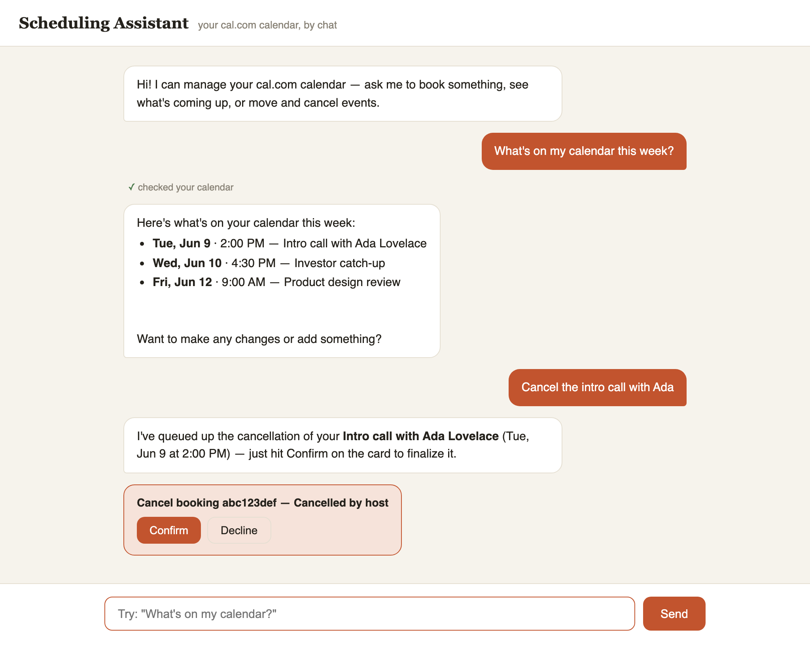

# Conversational scheduling assistant

A chatbot that lets a busy founder manage their [cal.com](https://cal.com) calendar through plain
conversation — book events, see what's coming up, cancel, and reschedule — powered by Claude, with
a web chat UI.



Built for the coding challenge described in [CHALLENGE.md](CHALLENGE.md). For the full
end-to-end walkthrough of every layer, see [docs/ARCHITECTURE.md](docs/ARCHITECTURE.md).

## Quick start

Requires [uv](https://docs.astral.sh/uv/) (`brew install uv`).

```bash
cp .env.example .env       # add your cal.com + Anthropic API keys
uv run uvicorn app.main:app
```

Open http://localhost:8000 and chat. Run the tests with:

```bash
uv run pytest
```

### Configuration (`.env`)

| Variable | Description |
|---|---|
| `CAL_API_KEY` | cal.com API key ([create one here](https://app.cal.com/settings/developer/api-keys)) |
| `ANTHROPIC_API_KEY` | Anthropic API key (required when `LLM_PROVIDER=anthropic`) |
| `LLM_PROVIDER` | `anthropic` (Claude) or `mock` (deterministic, runs with no LLM key; see below) |
| `LLM_MODEL` | Optional model override; defaults to `claude-opus-4-8` |
| `CAL_USERNAME` | Optional — resolved from your cal.com profile (`/me`) at startup if omitted |
| `TIMEZONE` | Optional IANA timezone, e.g. `America/New_York` — also resolved from `/me` |

## Architecture

```
Browser chat UI (app/static/index.html)
        │  POST /api/chat {session_id, message}     POST /api/chat/confirm {action_id, approved}
        ▼
FastAPI (app/main.py) — rate-limited per session
        ▼
Agent loop (app/agent/loop.py) ──── system prompt w/ live "now" (app/agent/prompts.py)
        │   provider-agnostic tool-use loop, per-session history,
        │   confirmation gate for destructive actions
        ├──► LLM provider (app/llm/) — Claude adapter or deterministic mock
        └──► Tool dispatch (app/agent/tools.py)
                     ▼
             CalComClient (app/calcom/client.py) ──► cal.com v2 REST API
```

- **Agent loop** — sends the conversation + tool schemas to the LLM; executes any tool calls it
  returns (concurrently) against cal.com; feeds results back; repeats until the LLM answers in
  prose. Iterations, history length, and session count are all capped.
- **Confirmation gate** — `cancel_booking` / `reschedule_booking` never execute off the LLM's
  decision alone. The call is frozen server-side and the UI shows a Confirm/Decline card; only an
  explicit click runs it, with exactly the frozen arguments. A prompt-injected booking title can't
  cancel anything.
- **Tools** — `list_bookings` (cursor-paginated), `list_event_types`, `get_available_slots`,
  `create_booking`, `cancel_booking`, `reschedule_booking`.
- **LLM abstraction** — the loop speaks only the neutral types in `app/llm/base.py`
  (`Message`, `ToolDef`, `ToolCall`, `LLMResponse`), so the vendor is swappable. The Anthropic
  adapter (`app/llm/anthropic.py`, Claude Opus 4.8 with adaptive thinking) and the deterministic
  `MockProvider` sit behind the same protocol; the mock keeps the whole stack runnable and
  testable with **no LLM API key**.
- **cal.com client** — thin async client over the v2 API. Note cal.com versions endpoints
  individually via the `cal-api-version` header; each method pins its documented version. With a
  key but no `CAL_USERNAME`/`TIMEZONE`, startup resolves both from `GET /me`.

### Mock-mode phrasings

With `LLM_PROVIDER=mock`, the assistant understands simple deterministic phrasings:

- `What's on my calendar?`
- `What event types do I have?`
- `Show slots for event type 123`
- `Book event type 123 at 2026-06-12T10:00:00Z for ada@example.com`
- `Cancel booking <uid>`
- `Reschedule booking <uid> to 2026-06-12T10:00:00Z`

With the Claude provider these are free-form ("book a 30-min intro with a candidate Thursday
afternoon"), with the model doing the date resolution and slot negotiation the system prompt
describes.

## Known trade-offs

- Sessions are in-memory (one per browser tab) and evicted oldest-first past a cap — fine for a
  demo, not multi-process safe. The rate limiter is in-process for the same reason.
- Responses are plain JSON (no streaming) — acceptable at chat-reply sizes; SSE streaming is the
  natural next step.
- The system prompt embeds the current time each turn (so "tomorrow" stays correct in a
  long-lived server), which defeats prompt caching of the message history — a conscious
  correctness-over-cost choice at this scale.
